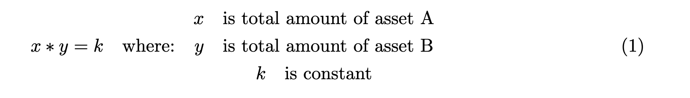
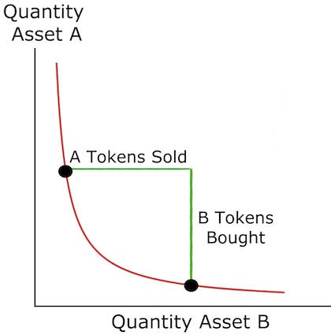
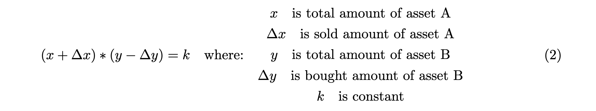
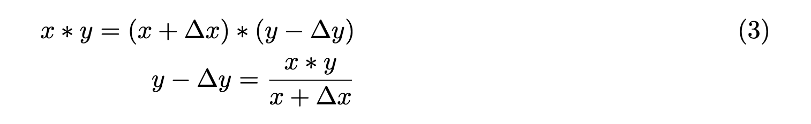
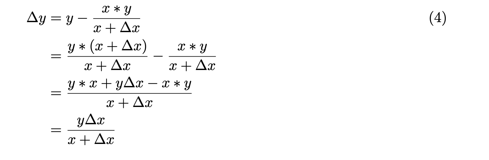
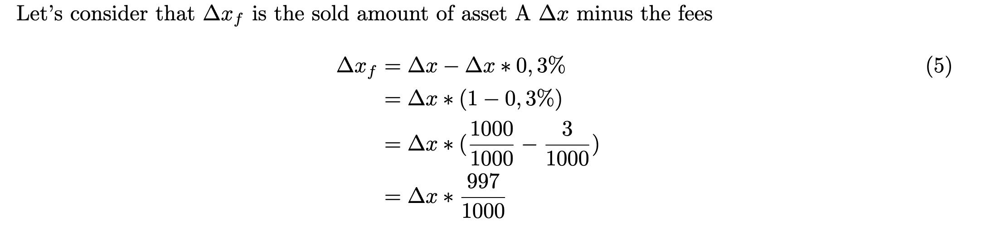
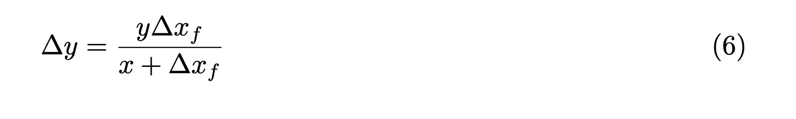
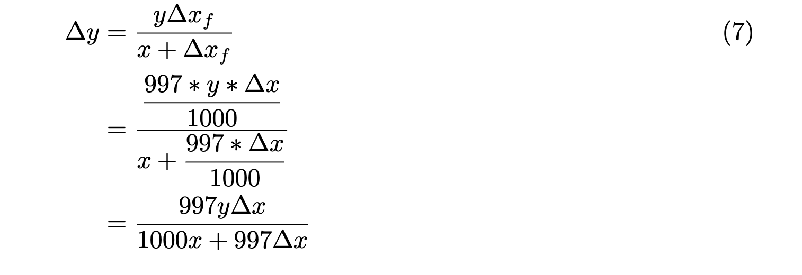

# Uniswap V1

This doc is related to basic implementation of Uniswap V1 and which is maintained in:

-   Contracts : `/contracts/amm/uniswap-v1/`
-   Tests: `/test/amm/uniswap-v1`

All the functions are properly documented. Hence we will just explain how we got the formula in the pricing function `getAmount`.

## What is Decentralized Exchange (DEX)

First of all, if you are not familiar with DEX then get familiar with:

-   [DEX](https://www.coinbase.com/learn/crypto-basics/what-is-a-dex)
-   [Automated Market Maker](https://www.gemini.com/cryptopedia/amm-what-are-automated-market-makers)

## Uniswap v1

Uniswap is a leading DEX. There have been 3 versions. this tutorial focuses on the 1st version v1 and which was launched in November 2018.
The documentation of Uniswap V1 can be found [here](https://docs.uniswap.org/protocol/V1/introduction).

An exchange is a ETH-ERC20 liquidity pool. Allowing :

-   Liquidity providers (LP) can deposit equivalent amout of ETH & ERC20 and get liquidity pool tokens in exchange. Allowing them to collect fees on ETH <-> ERC20 swaps
-   Users can swap ERC20 for ETH and vice-versa. Fees are 0,3 % per swap

A factory allows creation & deployment of any ETH-ERC20 exchange. Allowing:

-   Keep track of all ETH-ERC20 exchanges
-   Any ETH-ERC20 can support token to token swaps. E.g. : Let say there is a ETH-LINK exchange & ETH-USDT exchange. One can trade LINK for USDT in a single transaction (ETH is used as a bridge between both exchanges)

## Constant product formula

The pricing of ETH-ERC20 is based on the constant product formula:



In order to buy some amount of token B, one must sell a proportional amount of token B while maintaining `k` constant (cf. curve below).



Therefore, after a given amount of token A are sold for tokens B , we still maintain the k constant.



Combining _(1)_ and _(2)_ :



We can then have an equation which gives us the relantionship between amount bought of Token B _Δy_(aka outputAmount) and the other variables which are known:

-   _x_: current amount of token A (aka token A reserve)
-   _y_ : current amount of token B (aka token B reserve)
-   _Δx_ : sold amount of token A (aka inputAmount)



Note that this equation is not final as it doesn't take the fees into account. The fees in Uniswap v1 are _0,3%_. Fees are always taken from the _inputAmount_ :





Now if we combine _(5)_ and _(6)_:



which is the _getAmount_ function in _Exchange.sol_:

```solidity
function getAmount(
    uint256 inputAmount,
    uint256 inputReserve,
    uint256 outputReserve
) private pure returns (uint256 outputAmount) {
    require(inputReserve > 0 && outputReserve > 0, "Reserves cannot be null");
    uint256 inputAmountWithFee = inputAmount * 997;
    uint256 numerator = inputAmountWithFee * outputReserve;
    uint256 denominator = (1000 * inputReserve + inputAmountWithFee);

    outputAmount = numerator / denominator;
}

```
## References

- [Uniswap V1 Whitepaper](https://hackmd.io/@HaydenAdams/HJ9jLsfTz)
- [Ivan Kuznetsov](https://github.com/jeiwan) posts on uniswap:
  - [uniswap v1 part1](https://jeiwan.net/posts/programming-defi-uniswap-1/)
  - [uniswap v1 part2](https://jeiwan.net/posts/programming-defi-uniswap-2/)
  - [uniswap v1 part3](https://jeiwan.net/posts/programming-defi-uniswap-3/)
